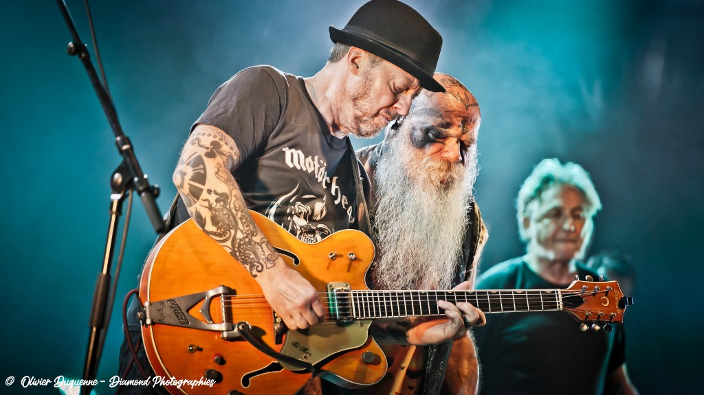
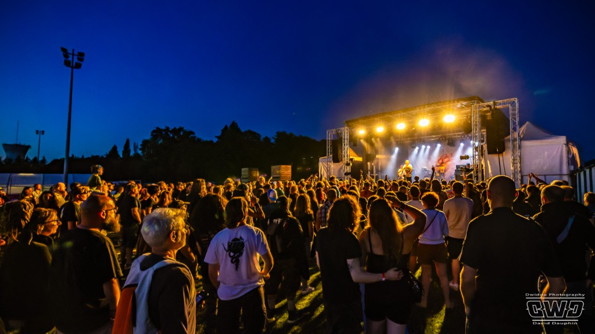
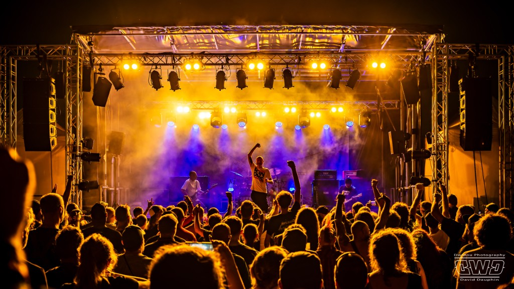
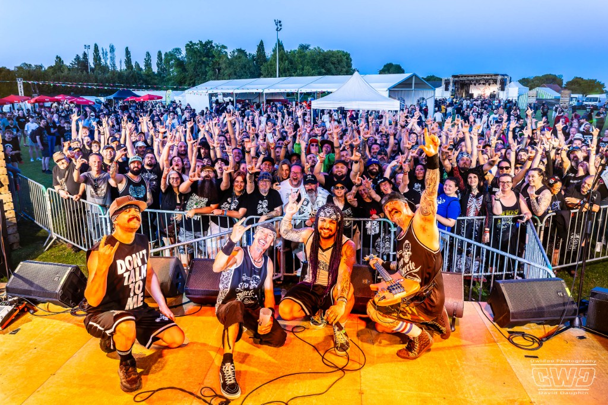
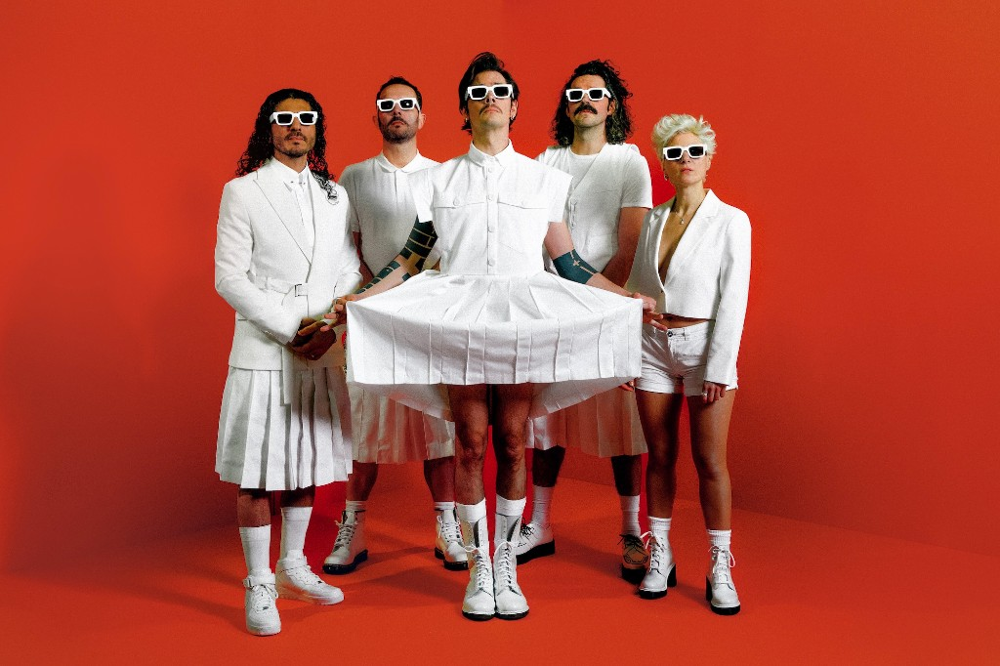

# OFFRE MÉCÈNE CJD AMIENS

> **Page web (lien non listé dans le menu)** : `https://barnrock-festival.fr/p/cjd-mecene-26` — contenu servi depuis `public/offre-privee/`. Après modification du HTML source ou des images dans `communication/docs/partenariats/`, lancer **`npm run sync:offre-cjd`** pour recopier vers `public/`.

> **TARIF EARLY BIRD — Offre valable jusqu'au 31 mai 2026**  
> Souscrivez avant le 31 mai pour bénéficier du tarif préférentiel.

## Nous sommes ravis de vous accueillir

Toute l'équipe du Barb'n'Rock est **très heureuse** de vous recevoir sur le site du festival pour votre plénière. C'est un moment fort pour nous de croiser des dirigeants engagés de la région, au cœur de notre projet associatif.

### Le festival en images — édition 2025

Quelques photos de **l’édition 2025** pour illustrer l’ambiance sur le terrain :

| | |
|:---:|:---:|
|  |  |
| **Les Garçons Bouchers** — © Olivier Duquenne, Diamond Photographies | **Lofofora** — public au crépuscule — © David Dauphin, Dwidou Photography |
|  |  |
| **Lofofora** — © David Dauphin, Dwidou Photography | **Loco Muerte** & foule — © David Dauphin, Dwidou Photography |

*Ces clichés restent la propriété des photographes ; usage accordé dans le cadre de la communication du festival.*

### Votre accueil le jour J (vendredi 26 juin)

Nous vous attendons **dès le matin** pour un **accueil café / croissants** sur le site du festival, en lien avec votre plénière.

- **Stationnement :** vous pourrez vous garer sur le **parking production**, directement sur l’événement (accès dédié équipes & partenaires, pas le parking grand public).
- **Repas / Plénière :** accueil à l’**espace Catering** — lieu **réservé aux artistes** pendant le festival, au plus près des équipes et des groupes.

### Et le soir : passez en expérience VIP

Votre **entrée vendredi soir** est déjà incluse. Ce pack mécène vous propose d'**upgrader** cette soirée : espace VIP, coulisses, cashless, invités… pour vivre le concert sous un autre angle, après votre journée de travail.

---

## Programme concerts — vendredi soir

**Ouverture des portes à 18h00**, **premier concert à 19h00**. **Cinq groupes** pour une mise en jambe rock / metal accessible :

| Ordre | Artiste |
|:-----:|---------|
| **Tête d’affiche** | **Cachemire** — rock français puissant, riffs et textes qui dépotent ; **le groupe à ne pas manquer** sur cette soirée. **[Voir la vidéo YouTube du groupe](https://www.youtube.com/watch?v=PjQw3HI2LJo)**. |
| 2 | Psykup |
| 3 | Kami No Ikari |
| 4 | Barabbas |
| 5 | Black Hazard |

## Contexte

Les membres du CJD Amiens seront présents le **vendredi 26 juin 2026** pour leur plénière à Crèvecœur-le-Grand. Chaque membre dispose déjà d'une **place "simple" incluse** pour le vendredi soir.

Cette offre permet à chaque membre d'**upgrader son expérience** en devenant mécène du festival.

---

## PACK MÉCÈNE CJD - 250€

### Ce que comprend le pack

| Avantage | Détail |
|----------|--------|
| **Cashless** | 30€ de crédit (consommations bar & food trucks) |
| **Invités** | 2 pass vendredi supplémentaires pour vos proches |
| **Espace VIP** | Accès à l'espace VIP toute la soirée |
| **Backstages** | Visite exclusive des coulisses |
| **Visibilité** | Logo de votre entreprise sur le site du festival |

### Avantage fiscal

| | Montant |
|---|---------|
| **Don** | 250€ |
| **Réduction fiscale (60%)** | -150€ |
| **Coût réel** | **100€** |

> Pour **100€ net**, vous profitez d'une soirée VIP complète avec 2 invités et soutenez un événement culturel local.

### Valeur des contreparties (conformité fiscale)

- 2 pass vendredi : 26€ (2 × 13€)
- Cashless : 30€
- **Total contreparties : 56€** (< 25% du don = 62,50€ ✓)

*Note : L'accès VIP, backstages et logo sont considérés comme avantages symboliques non valorisables.*

---

## EMAIL TYPE À ENVOYER AU CJD

**Objet :** Offre exclusive Barb'n'Rock pour les membres du CJD Amiens

---

Cher(e) membre du CJD,

Nous sommes **ravis de vous accueillir** le **vendredi 26 juin** au Barb'n'Rock pour votre plénière CJD.

**Dès le matin**, un **accueil café / croissants** vous attend sur le site. Vous pourrez **vous garer sur le parking production** (directement sur l’événement). **Repas / Plénière :** accueil à l’**espace Catering** — lieu **réservé aux artistes** pendant le festival, au plus près des équipes et des groupes.

**Le soir**, la scène vous propose notamment **Cachemire** en tête d’affiche (rock français au top) : **[vidéo sur YouTube](https://www.youtube.com/watch?v=PjQw3HI2LJo)**. Portes **18h**, premier concert **19h**. Avec votre place incluse, vous pouvez aussi **passer en expérience VIP** grâce au pack mécène ci-dessous.

### PACK MÉCÈNE CJD - 250€ (100€ après réduction fiscale)

Transformez votre soirée en expérience VIP :

**🍺 30€ de cashless** pour vos consommations au bar et food trucks

**👥 2 invités supplémentaires** - Faites découvrir le festival à vos proches

**⭐ Accès espace VIP** - Coin privilégié avec vue sur scène

**🎸 Visite des backstages** - Découvrez l'envers du décor

**📍 Votre logo sur notre site** - Visibilité pour votre entreprise

### Pourquoi devenir mécène ?

✅ **Soutenez la culture locale** - Le Barb'n'Rock est organisé par une association loi 1901  
✅ **Avantage fiscal de 60%** - Un don de 250€ ne vous coûte que 100€  
✅ **Vivez une expérience unique** - Au-delà de la plénière, profitez vraiment du festival  
✅ **Fédérez vos proches** - Invitez 2 personnes à vous rejoindre  

### Comment souscrire ?

**Contactez-nous** par mail à **[barbnrock.festival@gmail.com](mailto:barbnrock.festival@gmail.com)**, ou par téléphone : **Luc Pouilly** — [06 27 81 62 03](tel:+33627816203).

Ensuite : nous vous envoyons la **convention de mécénat**, vous réglez par **virement ou chèque**, et vous recevez votre **reçu fiscal**.

**📅 Date limite : 15 juin 2026** pour garantir l'intégration de votre logo sur le site.

---

**À propos du Barb'n'Rock Festival**

4ème édition du festival de musique metal/rock, les 26-28 juin 2026 à Crèvecœur-le-Grand (60). Vendredi soir : programmation rock/metal accessible. Samedi : têtes d'affiche (Loudblast, Shaârghot...). Dimanche : journée famille.

3 000 festivaliers attendus. 100% artistes français.

---

Au plaisir de vous accueillir en VIP !

L'équipe du Barb'n'Rock Festival  
barbnrock-festival.fr  
barbnrock.festival@gmail.com

---

## RELANCE (J+7)

**Objet :** RE: Offre mécène CJD - Derniers jours pour souscrire

---

Bonjour,

Je me permets de revenir vers vous concernant l'offre mécène réservée aux membres du CJD Amiens.

**Rappel du pack à 250€ (100€ net après réduction fiscale) :**
- 30€ de cashless
- 2 invités supplémentaires
- Accès VIP + backstages
- Logo sur le site

La plénière approche et nous devons finaliser la liste des mécènes pour l'accueil VIP.

Intéressé(e) ? Un simple retour d'email suffit pour réserver votre place.

Bien cordialement,

L'équipe Barb'n'Rock

---

## FICHE DE SUIVI

| Entreprise | Contact | Email | Statut | Date relance | Notes |
|------------|---------|-------|--------|--------------|-------|
| | | | | | |
| | | | | | |
| | | | | | |

**Statuts possibles :** Contacté / Relancé / Intéressé / Confirmé / Payé / Refusé

---

## DOCUMENTS À PRÉPARER

- [ ] Convention de mécénat type (modèle existant à adapter)
- [ ] Facture/reçu fiscal
- [ ] Liste des mécènes CJD (pour accueil VIP le jour J)
- [ ] Accueil matinal : café / croissants + signalétique parking **production**
- [ ] Déjeuner plénière : espace **Catering** / repas des artistes (réservations, accès)
- [ ] Bracelets VIP dédiés
- [ ] Créditer 30€ cashless sur les bracelets

---

## CONTACT CJD AMIENS

*À compléter :*
- Nom du contact CJD :
- Email :
- Téléphone :
- Nombre de membres prévus à la plénière :
